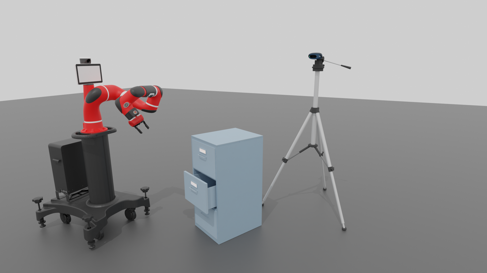
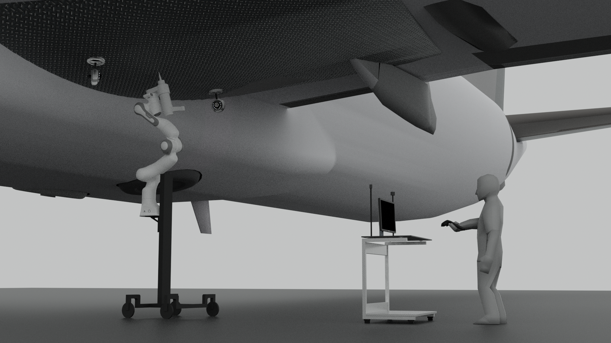
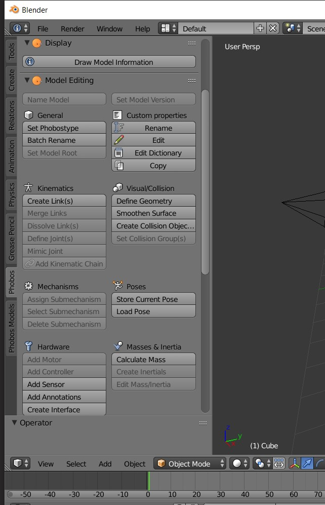
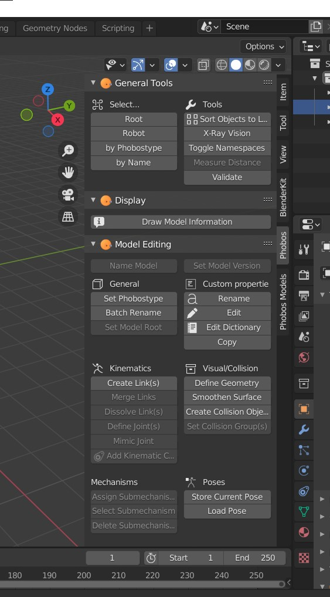

# CS 699 Fall 2021 - Final Report

### _Sage Livingstone_

-----

## Goals

[Link to previous final report: Summer 2021](https://github.com/SagewLivingstone/urdf_environments/tree/main/docs/report)

This semester began with a continuation of the preceding summer's projects. Namely, the goal of building a good pipeline for us to create and import complex and articulated scenes into our simulators/visualization tools was the primary target at the beginning of this period. The shift, however, was towards learning to actually generate and use these scenes in a practical setting; A few preliminary scenes had been created over the summer, but they had not yet been put into use in our other tools. Because our tooling is defined around its actual application/use case specific to our needs, we needed to test how the models would function before we built more of them without purpose.

An extension of this goal was to package up these tools into a manner that anyone in the lab would be able to utilize them without too much hassle. The aim was to create a set of tools that any of the lab members could use if they needed specific models, images, scenes, etc. for their projects or papers. A lot of work was thus put into making these tools functional and user-friendly so a vast knowledge of Blender/URDF was not needed to accomplish common tasks. This also implies the need for significant documentation on the tooling and programs.

## Results

### Image Renders

One of the first goals that became immediately apparent with the newly created scenes and tools was the ability to render out high quality images for our papers using Blender. Two major image renders were made for both Yeping and Pragathi's papers, consisting of robots placed in relevant scenes to demonstrate operations. The images were static and used mostly pre-made objects with a few exceptions.

*Render of a Sawyer robot scenario opening a cabinet*

*Render of an operator controlling a Franka Panda to work on an airplane wing*

The images are rendered in Blender 2.9.3 using the Cycles rendering engine, but were initially processed in Eevee. This allowed for a rapid iteration on lighting and composition, and was one of the many useful tips learned along the way. The images were intentionally left matte and mostly-untextured for the sake of readability, however some work needs to be done in the rendering techniques to allow for better distinction between objects. Blender is built around Photorealistic rendering out-of-the-box, so modifications need to be made to get a more 'cartoonish' look for a technical diagram. Objects were sourced from various free 3D model websites, such as *cgtrader* and *free3d*, but some cases models were custom-built as a satisfactory model could not be found online. (e.g. the plaster gun on the Panda arm)

This method of rendering is highly powerful as it uses the flexible Blender program to compose and render scenes. This allows for a lot of room to adjust and add custom elements to images. In the future this would also lead to video rendering as well. A convenient extension of this is that the scenes made for simulation (e.g. Kitchen and Robot Room scenes, see previous report for Summer 2021) can be imported for rendering as well. This is nice as we can have a collection of scenes for a variety of purposes, and simply change LOD properties in Blender as needed. A script was also created that allows importing CSV motions files into Blender for robots, which will likely be very useful in the future (we can thus render frame-by-frame videos of simulations in high quality).

### Phobos Upgrade

Most of these renders were done well before the project to upgrade Phobos began, so the importing of scenes and robots needed to be done manually. This leads into the desire to upgrade Phobos (Blender plugin used to interface with URDF models), as the manual process is very tedious and requires strong knowledge of Blender. Phobos currently exists in a stable state as an addon to Blender 2.79b. However, this Blender version is now dated, and newer rendering tools exist in the current version 2.9.3. Thus, it was determined that upgrading Phobos to Blender 2.9.3 was a good allocation of time, as it would allow other lab members to utilize these tools to render out their own images/videos as well.

*Phobos toolbar in Blender 2.79b (old version)*

*Phobos toolbar in Blender 2.9.3 (upgraded version)*

At its current state as of 12/22/2021, Phobos has now been upgraded to function with all base tools (of interest to us) in Blender 2.9.3. The sole exception is that materials do not export/import correctly: this is a complicated and deep issue, which is explained further below. Care was put into ensuring that all of the tools that were relevant to our work were transferred over correctly. This means that anyone who has a URDF can now import it into Blender 2.9.3 (our rendering platform) with a few button clicks, instead of needing deep knowledge of Blender and URDF composition. This also means that users who are somewhat comfortable with Blender can modify and create their own URDFs, and export them into their own programs. This was a main goal for this project, and should hopefully lead to higher quality models and renders in the near future.

Texture import is mostly correct but had edge cases and limitations. Texture export is not completed and only solid colors are possible at the moment. This is a great area for next steps in this project, and will likely see development in the future.

### Applications of Phobos

A key aspect of these upgrades and tool developments was to be able to apply them to our other work. More testing was done this semester to ensure that we could use these tools in other programs and environments, not just in Blender. Gia-Phong has been working on a Three.js-based browser visualizer for robotics, which is now using these scene and models files created in Phobos to give better background and context for his visualizations. This is a good first-sign of the use cases of these tools, however this is the only use of these models externally as of today. In the future, it would be wise to test these models in other programs (Gazebo, CoppeliaSim, Unity, ...) to ensure that we are creating useful and functional models for others to use. Also, other programs may require specific tweaks to exports of URDFs (e.g. filepathing, model format, packaging) which may warrant further development of the Phobos package.

The code for Phobos is located withing this repo at `/phobos/`. Additional scripts (the Blender CSV animation plugin) can be located at `/src/`. Models used can be found in `/objects/` and images rendered in Blender 2.9.3 can be found in `/images/`. The `/scenes/` folder contains scenes made strictly for rendering in Blender 2.9.3 (non-URDF), and `/robots/` contains model data for the robots we used in our renders. More word needs to be done to consolidate the many scenes and robot models used over old and new versions of Blender.

Going forward, it would be in the interest of the community to package the Phobos changes and submit PRs to the main Phobos repository. However, more bug testing and style cleanup needs to be done before those PRs are submitted. Additional work could be put into learning Blender's stylized rendering (particularly flat-shading and edge detection), which would be helpful in creating readable images for papers and talks. Finally, a solid body of documentation needs to be created now that Phobos is upgraded to the newer version of Blender, and thus the process to import/export models is solidified.

## Work Done

At the start of the semester, a couple weeks were dedicated to finishing some of the scenes from the summer. This included re-texturing some of the objects and populating the scenes with more interactive items. After that, while waiting for other tasks I began to help Yeping with a project to generate images for his paper. This began the overall goal of using Blender to generate images/videos for our research. After helping Yeping and Gia-Phong with renders and their interactive web-based viewers, I helped Pragathi with her project by rendering another set of images for the airplane wing scene. It was at this point that I determined the need for upgrading Phobos to the newer Blender version. This was because our renders were heavily relying on features from the new version, and not having Phobos in our workflow in Blender 2.9.3 was greatly slowing down the process. Phobos was also in need of some updates, so this was a good time to do so. 

The following final month and a half was mainly dedicated to investigating the Blender API, learning how Phobos works internally, and integrating our changes into it. Then, I switched to an existing branch that was aimed at getting Phobos working on Blender 2.9.3, and worked to complete the remaining features needed. Finally, I worked a bit in the last 2 weeks to integrate changes I had made to old Phobos (filepathing, material handling) into the new version. However, there was unfortunately not enough time to finish this integration fully. Materials currently only handle solid colors, not texturing, but filepathing was mostly completed.

I met with a graduate student at Rice who explained some of their dataset to me, and the possibility of using our tools to help each other. However, their data was unfortunately too far from our desired state (e.g. geometry data in giant lists of vertices instead of using model files), so the overlap in use cases was unclear. Also their URDF scenes are much, much more rudimentary than our which questions their use case with and in our tools. In the future this could be explored if they hope to use more complex scenes in their pathing solvers.

### Lessons

A lot was learned regarding the usage of Blender as both a rendering and modeling tool. I was already somewhat comfortable with Blender coming in, but as it is a large and complex program there is an unending series of tools to learn within it. I also picked up a few modeling techniques that helped us make some quick demo objects for our scenes. Rendering technical images was completely new to me, and I learned quite a lot about lighting, rendering flat/stylized shading, and other techniques to make these renders work.

I also spend a significant amount of time working with the Blender API and interfacing with its data models. This was very insightful: not only for creating scripts and plugins, but also for understanding what is going on under the hood in Blender. The data model for Blender is oddly both very flexible and inflexible at the same time - this mean that Phobos has to pull some 'tricks' to represent URDFs as Blender objects. Learning how the original developers made this possible was very insightful and showed the power of the tool.

Blender materials are a complicated subject and are based on the shader and rendering engine used. Unfortunately, there is not only one rendering engine (2 commonly used) in Blender, and many different material types utilize different shaders. This became a bit of a headache to manage and backtrace the data from shader materials to find textures to export. I was not able to parse more than just solid material colors by the end of the semester, but I would like to spend more time in the future creating a solid method to extract textures and attach them to URDFs.

## Self-Evaluation

During this semester, I feel like I got some good progress on the overall goal of making scenes and scene tools for our robot applications. On top of that I felt that some good progress was made in making renders for our papers/etc. I would have liked to get Phobos to a state where I could submit some PRs to the main branch (as open source contribution is something I would like to get into), however due to time restrictions it was too large of a task. This semester unfortunately was easily the busiest I've ever had in terms of finals (a combination of hard classes and in-peron adjustments of sort), and therefore the Phobos project ended somewhat abruptly. However, the state it ended is definitely workable and a good base going forward.

I also felt I had much more opportunities this semester to collaborate with other lab members on projects, especially with all the image render requests. This felt like good progress compared to the summer where my work was somewhat isolated. I also got to help Gia-Phong a bit with the scenes he was making in his tool. I also enjoyed working more with Blender and learning all the powerful things it can do - it feels like I learn 5 new things every hour I work in it. I would have liked more time at the end of the semester to set up documentation for the tools I made, but I think the existing docs I've left should help as a baseline.

Overall I feel like I made a lot of progress this semester with the tools, and I'm looking forward to moving on with Blender in the future.
